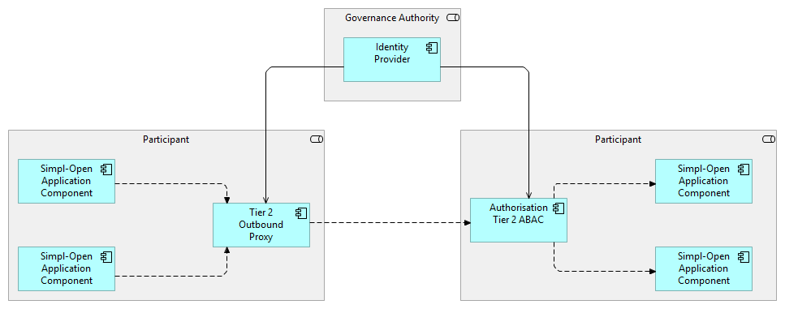

# Tier2 Proxy

## Purpose
The Tier 2 outbound proxy is a Simpl-Open middleware architecture component. It is designed to enable secure
and compliant agent-to-agent communication from internal components that cannot be modified using the SIMPL HTTP client library.

These components may include:

- Brownfield systems that are legacy or third-party and cannot be updated to use custom libraries
- Services implemented in incompatible programming languages or frameworks
- Applications using HTTP client stacks that do not support SIMPL’s extensions for dynamic credential selection or mTLS

By transparently routing their outbound traffic through the proxy, these components can participate in
dataspace communications without needing to be rewritten.

Additionally, for each component, we will enable:

- automatic logging
- credential-based authentication (via mTLS negotiation with other SIMPL participants)

## Key Functions

The outbound proxy serves the following functions:

- Enable dataspace-compliant communication for non-adaptable or brownfield components
- Intercept and inspect outbound HTTP(S) traffic while preserving secure communication
- Facilitate dynamic mTLS authentication with other SIMPL agents using onboarded credentials
- Capture audit destination endpoints and protocols used
- Provide operational flexibility through support for standard proxy protocols (SOCKS 4a/5 and HTTP CONNECT)

## Bootstrapping and Trust Anchoring

Before operational use, the proxy undergoes a bootstrapping process:

- The proxy initialises its own internal Certificate Authority to support TLS interception
- The root certificate of this CA is provided to internal clients, enabling them to trust dynamically generated certificates
- The proxy is now able to decrypt and forward outbound HTTPS traffic transparently

This process ensures secure operation without requiring changes to the internal services themselves.

## High-level overview

How the proxy interacts with any SIMPL is described in this diagram:



A SIMPL-Open agent can be configured to route outbound traffic from a specific internal component through the
outbound proxy by setting it as the component’s designated proxy. Once configured, all HTTP(S) communication
initiated by that component is transparently redirected to the proxy, enabling inspection, dynamic credential
injection, and compliance enforcement without requiring changes to the component itself.

## Traffic Handling Overview

## Plaintext (HTTP or SOCKS)

- SOCKS 5 protocol: The proxy accepts unauthenticated connections and logs the connection metadata (source, destination).
- HTTP: Requests are forwarded as-is to the destination. Full URIs and response status codes are logged.

This mode enables visibility over traditional, non-encrypted communication.


## Encrypted (HTTPS/TLS)

> The way the handshake process between participants is designed follows Simpl-Open Security Architecture -
  SIMPL - Confluence, "Agent-to-Agent Communication - Details" section.

**Connection Establishment**:

1. Clients connect using SOCKS CONNECT or HTTP CONNECT
- The proxy establishes a TLS session with the client using a forged certificate, dynamically generated and signed by the internal CA
- The proxy parses the SNI (Server Name Indication) to determine the target hostname and issues a matching forged certificate

**Forwarding with TLS/mTLS**:

1. The proxy attempts to establish a secure connection to the destination
- If the destination is identified as a SIMPL peer, it attempts to upgrade the connection to mutual TLS,
authenticating itself with the participant’s credentials
- If mTLS fails or is unsupported, it falls back to standard TLS


## Logging

All stages of the handshake, interception, and forwarding are logged, including:

- SNI and target domain
- Whether mTLS was attempted and succeeded or failed
- Certificate details and request/response status

## Summary

The Tier 2 outbound proxy acts as a compliance and connectivity enabler within the SIMPL Open agent
architecture. It bridges the gap between dataspace trust requirements and the practical realities of legacy or
externally developed systems. By supporting passive interception and credential-aware forwarding, it provides
a pathway for agent-to-agent communication even in constrained deployment contexts.

## Performance Considerations

Introducing a proxy layer inherently adds some degree of overhead compared to using the client library
directly. While the client library can handle everything internally, the proxy requires an additional HTTP
hop: the original component initiates an HTTP request, which is then handled by the proxy (involving I/O
between the component and the proxy), followed by another I/O operation from the proxy to the external
resource. On top of this, the proxy must allocate computational resources to actively process and route the
traffic. This added complexity naturally introduces latency and resource consumption. The only way to
eliminate this overhead would be to remove the proxy entirely and integrate the client library directly into
each component. However, this approach would partially conflict with one of the proxy’s key objectives:
enabling existing components to communicate through the SIMPL Tier 2 communication layer without requiring
changes to their implementation.

## 🚀 Runtime Behavior and Usage Examples

Once started, the Tier 2 Outbound Proxy listens on **three ports**, each serving a distinct purpose:

| Service                   | Description                                                                 | Default Port |
|---------------------------|-----------------------------------------------------------------------------|--------------|
| **Certificate Server**    | HTTP server for downloading the internal CA certificate                     | `3000`       |
| **HTTP/HTTPS Proxy**      | Handles outbound traffic via HTTP or HTTPS                                  | `3001`       |
| **SOCKS Proxy (v5)**      | SOCKS proxy for TCP-based outbound traffic                                  | `3002`       |

These ports can be customized via the application’s configuration:

```properties
proxy.certificate.server.port=3000
proxy.http.server.port=3001
proxy.socks.server.port=3002
```

### Prerequisites

Depending on how the proxy is expected to run (locally, with docker or k8s), prerequisites may vary.

- A participant agent deployed and onboarded within a dataspace - [Documentation](https://code.europa.eu/simpl/simpl-open/development/iaa/documentation)
- Kubernetes Cluster (if deploying the proxy in a Kubernetes environment)
    - kubectl - command-line tool for interacting with your cluster. See: https://kubernetes.io/docs/reference/kubectl/kubectl/
    - Helm - Package manager for Kubernetes used to deploy charts. See: https://helm.sh/
- Docker - See: https://docs.docker.com/

### Running the Proxy on Docker
The Tier 2 Outbound Proxy can be easily launched as a Docker container. Below is a basic example using the docker run command:

```bash
docker run --rm -it
  --name tier2-proxy
  --network host
  -v proxy-config/application.properties:/config/application
  --env PROXY_CERTIFICATES_SERVER_PORT=3000
  --env PROXY_HTTP_SERVER_PORT=3001
  --env PROXY_SOCKS_SERVER_PORT=3002
  --env SIMPL_AUTHENTICATION_PROVIDER_BASEURL=http://localhost:8105
  tier2-proxy:latest
```

Explanation:

- `--network` host: Ensures that the proxy can bind to the necessary ports on the host machine.
- `-v /tmp/proxy/config:/config`: Mounts the configuration directory into the container.
- `PROXY_CERTIFICATES_SERVER_PORT`, `PROXY_HTTP_SERVER_PORT`, `PROXY_SOCKS_SERVER_PORT`: Allow customization of the listening ports.
- `SIMPL_AUTHENTICATION_PROVIDER_BASEURL`: This must point to the base URL of the local Authentication Provider microservice used for SIMPL identity management and credential operations.

> Ensure that the `SIMPL_AUTHENTICATION_PROVIDER_BASEURL` is reachable by the container, and that the referenced service is up and running before starting the proxy.

### Running the Proxy on Kubernetes

The Tier 2 Outbound Proxy can be easily launched as a pod in Kubernetes.

The [`values.yaml`](charts/values.yaml) file is self-contained and provides all the necessary configuration for a standard deployment. 
However, you can customize any parameter according to your needs, by overriding values via another yaml (`-f other-values.yaml`).

This approach ensures a ready-to-use configuration, but remains flexible for different environments or specific requirements.
Below is a basic example using the provided Helm chart:

```bash
helm repo add tier2-proxy-charts https://code.europa.eu/api/v4/projects/1112/packages/helm/stable

helm install tier2-proxy tier2-proxy-charts/tier2-proxy \
--version <chart version> 
```

### Getting the CA Certificate
To retrieve the internal CA certificate used by the proxy, you can use the following command:

```shell
curl tier2-proxy.<your-namespace>.svc.cluster.local:3001/cert > ca.pem
```

### Testing the Proxy
You can verify that the proxy is functioning correctly using curl. Below are example commands for both **HTTP(S)** and **SOCKS5** modes, covering various handshake scenarios.

#### Using HTTP/HTTPS Proxy (Port 3001)
```shell
# MTLS on endpoint not protected by the ephemeral proof check
HTTPS_PROXY=tier2-proxy.<your-namespace>.svc.cluster.local:3001 \
curl --cacert ca.pem -x "tier2-proxy.<your-namespace>.svc.cluster.local:3001" -v -i \
'https://<tier2-destination-host>/identityApi/v1/mtls/whoami'

# MTLS on endpoint protected by the ephemeral proof check
HTTPS_PROXY=tier2-proxy.<your-namespace>.svc.cluster.local:3001 \
curl --cacert ca.pem -x "tier2-proxy.<your-namespace>.svc.cluster.local:3001" -v -i \
'https://<tier2-destination-host>/sapApi/v1/mtls/identityAttributes'

# Standard TLS fallback
HTTPS_PROXY=tier2-proxy.<your-namespace>.svc.cluster.local:3001 \
curl --cacert ca.pem -x "tier2-proxy.<your-namespace>.svc.cluster.local:3001" -v -i \
'https://www.google.com'
```

#### Using SOCKS5 Proxy (Port 3002)
```shell
# MTLS on endpoint not protected by the ephemeral proof check
curl --cacert ca.pem --socks5-hostname tier2-proxy.<your-namespace>.svc.cluster.local:3002 \
'https://<tier2-destination-host>/identityApi/v1/mtls/whoami'

# MTLS on endpoint protected by the ephemeral proof check
curl --cacert ca.pem --socks5-hostname tier2-proxy.<your-namespace>.svc.cluster.local:3002 \
'https://<tier2-destination-host>/sapApi/v1/mtls/identityAttributes'

# Standard TLS fallback
curl --cacert ca.pem --socks5-hostname tier2-proxy.<your-namespace>.svc.cluster.local:3002 \
'https://www.google.com'
```

These test commands help validate:

- TLS and mTLS negotiation
- Certificate injection
- Transparent routing
- Protocol fallback behavior

### How to configure application to use the Proxy

This is an introduction to using proxies in development environments.
When using a proxy in Java, **JVM flags** can be used at the time of application startup.
For more details, refer to the [Java documentation - Networking Properties](https://docs.oracle.com/en/java/javase/24/docs/api/java.base/java/net/doc-files/net-properties.html).
```cli
# HTTP usage 
java -Dhttp.proxyHost=127.0.0.1 -Dhttp.proxyPort=3001 -jar myapp.jar

# For SOCKS proxy configurations:
java -DsocksProxyHost=127.0.0.1 -DsocksProxyPort=3003 -jar myapp.jar
```

If your application runs inside a Docker container, you need to ensure that the JVM variables are properly passed.
Alternatively, if you plan to use Helm for deployment, you can optionally configure proxy settings within the chart values.

#### Example Dockerfile
```dockerfile
FROM eclipse-temurin:17-jdk
COPY . /app
WORKDIR /app
CMD ["java", "-Dhttp.proxyHost=proxy.example.com", "-Dhttp.proxyPort=3001", "-jar", "myapp.jar"]
```

In Python, proxy configuration can be done in code or via environment variables.

```python
# Install socks support if it necessary.
pip install PySocks

# Setup environment variable
export https_proxy=socks5://<hostname or ip>:<port>

# Run your script. This example makes request using proxy and shows IP-address:
# echo Your real IP
python -c 'import requests;print(requests.get("http://ipinfo.io/ip").text)'

# echo IP with socks-proxy
python -c 'import requests;print(requests.get("https://ipinfo.io/ip").text)'
```
