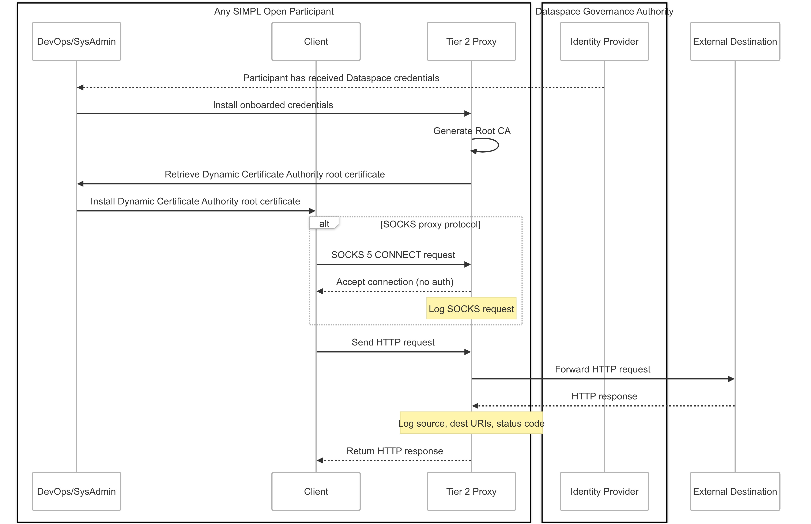
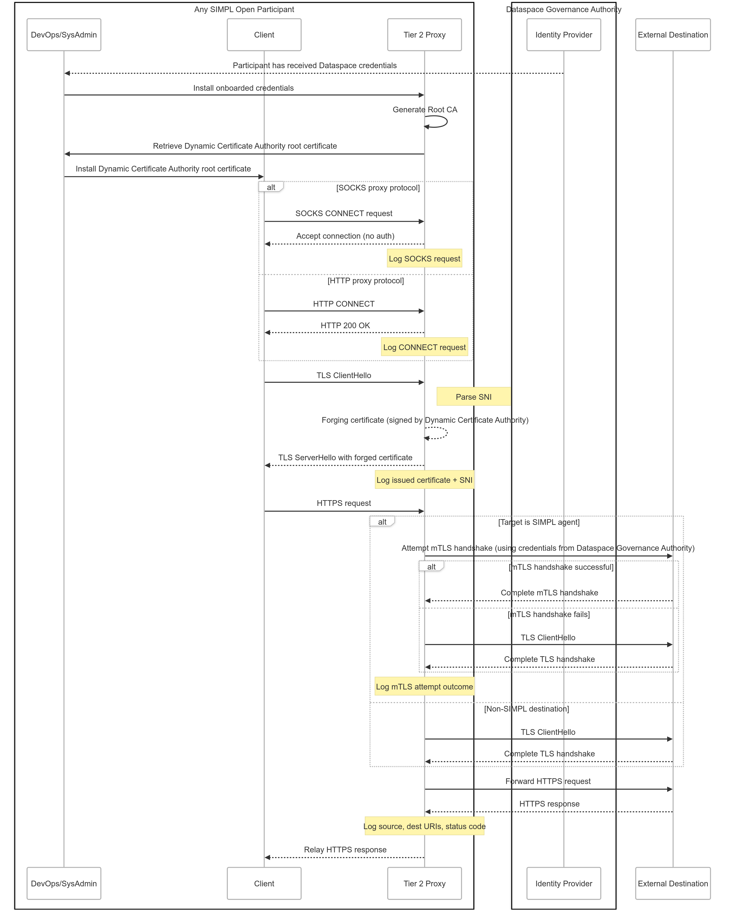

# User Manual

## Runtime Behavior and Usage Examples

Once started, the Tier 2 Outbound Proxy listens on **three ports**, each serving a distinct purpose:

| Service                   | Description                                                                 | Default Port |
|---------------------------|-----------------------------------------------------------------------------|--------------|
| **Certificate Server**    | HTTP server for downloading the internal CA certificate                     | `3000`       |
| **HTTP/HTTPS Proxy**      | Handles outbound traffic via HTTP or HTTPS                                  | `3001`       |
| **SOCKS Proxy (v5)**      | SOCKS proxy for TCP-based outbound traffic                                  | `3002`       |

These ports can be customized via the application’s configuration:

```properties
proxy.certificate.server.port=3000
proxy.http.server.port=3001
proxy.socks.server.port=3002
```

## Bootstrapping and Trust Anchoring

Before operational use, the proxy undergoes a bootstrapping process:

- The proxy initialises its own internal Certificate Authority to support TLS interception
- The root certificate of this CA is provided to internal clients, enabling them to trust dynamically generated certificates
- The proxy is now able to decrypt and forward outbound HTTPS traffic transparently

This process ensures secure operation without requiring changes to the internal services themselves.

## Traffic Handling Overview

### Plaintext (HTTP or SOCKS)

- SOCKS 5 protocol: The proxy accepts unauthenticated connections and logs the connection metadata (source, destination).
- HTTP: Requests are forwarded as-is to the destination. Full URIs and response status codes are logged.

This mode enables visibility over traditional, non-encrypted communication.



### Encrypted (HTTPS/TLS)

**Connection Establishment**:

1. Clients connect using SOCKS CONNECT or HTTP CONNECT
2. The proxy establishes a TLS session with the client using a forged certificate, dynamically generated and signed by the internal CA
3. The proxy parses the SNI (Server Name Indication) to determine the target hostname and issues a matching forged certificate

**Forwarding with TLS/mTLS**:

1. The proxy attempts to establish a secure connection to the destination
2. If the destination is identified as a SIMPL peer, it attempts to upgrade the connection to mutual TLS,
   authenticating itself with the participant’s credentials
3. If mTLS fails or is unsupported, it falls back to standard TLS



## Logging

All stages of the handshake, interception, and forwarding are logged, including:

- SNI and target domain
- Whether mTLS was attempted and succeeded or failed
- Certificate details and request/response status

## Performance Considerations

Introducing a proxy layer inherently adds some degree of overhead compared to using the client library
directly. While the client library can handle everything internally, the proxy requires an additional HTTP
hop: the original component initiates an HTTP request, which is then handled by the proxy (involving I/O
between the component and the proxy), followed by another I/O operation from the proxy to the external
resource. On top of this, the proxy must allocate computational resources to actively process and route the
traffic. This added complexity naturally introduces latency and resource consumption. The only way to
eliminate this overhead would be to remove the proxy entirely and integrate the client library directly into
each component. However, this approach would partially conflict with one of the proxy’s key objectives:
enabling existing components to communicate through the SIMPL Tier 2 communication layer without requiring
changes to their implementation.

## How to configure application to use the Proxy

This is an introduction to using proxies in development environments.
When using a proxy in Java, **JVM flags** can be used at the time of application startup.
For more details, refer to the [Java documentation - Networking Properties](https://docs.oracle.com/en/java/javase/24/docs/api/java.base/java/net/doc-files/net-properties.html).
```cli
# HTTP usage 
java -Dhttp.proxyHost=127.0.0.1 -Dhttp.proxyPort=3001 -jar myapp.jar

# For SOCKS proxy configurations:
java -DsocksProxyHost=127.0.0.1 -DsocksProxyPort=3003 -jar myapp.jar
```

If your application runs inside a Docker container, you need to ensure that the JVM variables are properly passed.
Alternatively, if you plan to use Helm for deployment, you can optionally configure proxy settings within the chart values.

**Important**: After downloading proxy's CA certificate with the following command:
```shell
curl tier2-proxy.<your-namespace>.svc.cluster.local:3000/cert > ca.pem
```

ensure that your client has installed it into its trust store, for example, if you are in a linux Debian based environment:

1) Update package list with:

```shell 
sudo apt update
```

2) Download and install ca-certificates package with 

```shell 
sudo apt install -y ca-certificates
```

3) Copy your certificate to the local CA certificates directory

```shell
sudo cp ca.pem /usr/local/share/ca-certificates/local-ca.crt
```

4) Update trusted certificates file with the following cmd:

```shell
sudo update-ca-certificates
```

If your application runs inside a Docker container, you need to ensure that the JVM variables are properly passed.
Alternatively, if you plan to use Helm for deployment, you can optionally configure proxy settings within the chart values.

### Example Dockerfile
```dockerfile
FROM eclipse-temurin:17-jdk
COPY . /app
WORKDIR /app
CMD ["java", "-Dhttp.proxyHost=proxy.example.com", "-Dhttp.proxyPort=3001", "-jar", "myapp.jar"]
```

In Python, proxy configuration can be done in code or via environment variables.

```python
# Install socks support if it necessary.
pip install PySocks

# Setup environment variable
export https_proxy=socks5://<hostname or ip>:<port>

# Run your script. This example makes request using proxy and shows IP-address:
# echo Your real IP
python -c 'import requests;print(requests.get("http://ipinfo.io/ip").text)'

# echo IP with socks-proxy
python -c 'import requests;print(requests.get("https://ipinfo.io/ip").text)'
```
